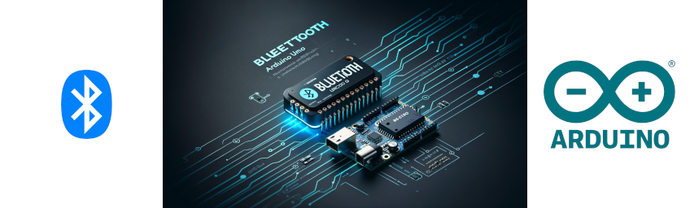

# Bluetooth Integration with Arduino UNO

Welcome to our GitHub repository designed to explore the capabilities and applications of Bluetooth technology in conjunction with the Arduino UNO microcontroller. This repository will provide sketches, libraries, and projects that demonstrate how to integrate Bluetooth modules like HC-05/HC-06 with Arduino UNO to build wireless projects.

## Introduction to Bluetooth Technology

Bluetooth is a wireless technology standard for exchanging data over short distances using UHF radio waves in the ISM bands, from 2.402 GHz to 2.48 GHz. It is designed to create quick and secure communications between devices without the need for wires.

In the context of Arduino projects, Bluetooth can be utilized to transmit and receive data between an Arduino board and other Bluetooth-enabled devices such as smartphones, laptops, or other microcontrollers.

## About Arduino UNO

Arduino UNO is a microcontroller board based on the ATmega328P. It has 14 digital input/output pins (of which 6 can be used as PWM outputs), 6 analog inputs, a 16 MHz quartz crystal, a USB connection, a power jack, an ICSP header, and a reset button.

The Arduino UNO is particularly well-suited for beginners due to its simple and accessible user interface, but it is also robust enough for complex projects. By incorporating Bluetooth technology, Arduino UNO can be used to create a variety of innovative, interactive projects.

## Repository Structure

- **/Libraries** - This folder contains all the necessary custom and third-party libraries needed for the Bluetooth projects.
- **/Sketches** - Here you will find all the Arduino sketches that are ready to be uploaded to your Arduino UNO board.
- **/Docs** - This directory includes all the documentation related to project schematics, part lists, and connection diagrams.
- **/Examples** - This folder provides basic examples to test the Bluetooth module's connectivity with the Arduino UNO.

## Bluetooth Modules

This repository primarily focuses on the HC-05 and HC-06 Bluetooth modules, which are widely used due to their ease of availability, cost-effectiveness, and compatibility with Arduino UNO.

### HC-05

- 2.402 - 2.480 GHz ISM Band
- Can be configured as Master or Slave
- Default Baud rate: 9600 Bps
- Secure Simple Pairing and Encryption

### HC-06

- Slave module only
- 2.402 - 2.480 GHz ISM Band
- Default Baud rate: 9600 Bps
- Cannot act as a master

## Project Examples

- **Basic Echo Test** - Simple sketch to test communication between Arduino and smartphone.
- **Remote LED Control** - Control an LED connected to Arduino UNO via a smartphone app.
- **Data Logging to Phone** - Send sensor data from Arduino UNO to a mobile phone for logging and analysis.

## Getting Started

To get started with these projects, you will need an Arduino UNO board, a Bluetooth module (HC-05 or HC-06), and some basic electronic components like resistors, LEDs, and breadboards. Wiring diagrams and setup instructions are provided in the `/Docs` and `/Examples` folders.

Please refer to the individual project directories for detailed information on project requirements, setup instructions, and source code.

## Contributions

Feel free to fork this repository and contribute to improving the projects by submitting pull requests. Your feedback and contributions are highly appreciated!

## License

This project is licensed under the MIT License - see the [LICENSE.md](LICENSE.md) file for details.

## URLs

+ Wikipedia
  + https://en.wikipedia.org/wiki/Bluetooth
  + https://en.wikipedia.org/wiki/Bluetooth_Low_Energy
  + https://en.wikipedia.org/wiki/Bluetooth_stack
  + https://en.wikipedia.org/wiki/Bluetooth_Low_Energy_beacon
  + https://en.wikipedia.org/wiki/Bluetooth_mesh_networkin
  + https://en.wikipedia.org/wiki/Bluetooth_Special_Inhttps://www.google.com/search?q=arduino+bluetooth+tutorial+pdf&oq=Bluetooth+Arduino+tutorial&gs_lcrp=EgZjaHJvbWUqCAgBEAAYFhgeMgYIABBFGDkyCAgBEAAYFhgeMggIAhAAGBYYHjIICAMQABgWGB4yCAgEEAAYFhgeMggIBRAAGBYYHjIICAYQABgWGB4yCAgHEAAYFhgeMggICBAAGBYYHjIICAkQABgWGB7SAQoyOTQ5OWowajE1qAIIsAIB&client=ubuntu-chr&sourceid=chrome&ie=UTF-8terest_Group
+ Bluetooth 
  + https://www.bluetooth.com/
  + https://www.bluetooth.com/bluetooth-resources/?types=video&categories=training-videos
+ Adafruit
  + https://learn.adafruit.com/introduction-to-bluetooth-low-energy
  + https://cdn-learn.adafruit.com/downloads/pdf/introduction-to-bluetooth-low-energy.pdf
  + https://learn.adafruit.com/bluefruit-le-connect
  + https://www.youtube.com/results?search_query=Adafruit+bluetooth
+ YouTube
  + https://www.youtube.com/results?search_query=bluetooth
  + https://www.youtube.com/@Ellisys
    + https://www.youtube.com/playlist?list=PLYj4Cw17Aw7ypuXt7mDFWAyy6P661TD48
  + https://www.youtube.com/results?search_query=Arduino+bluetooth
  + https://www.youtube.com/results?search_query=Audriuino+UNO+R4+bluetooth 
+ SoarkFun
  + https://www.youtube.com/results?search_query=SparkFun+Bluetooth
+ Arduino bluetooth tutorial pdf
  + https://www.google.com/search?q=arduino+bluetooth+tutorial+pdf&oq=Bluetooth+Arduino+tutorial&gs_lcrp=EgZjaHJvbWUqCAgBEAAYFhgeMgYIABBFGDkyCAgBEAAYFhgeMggIAhAAGBYYHjIICAMQABgWGB4yCAgEEAAYFhgeMggIBRAAGBYYHjIICAYQABgWGB4yCAgHEAAYFhgeMggICBAAGBYYHjIICAkQABgWGB7SAQoyOTQ5OWowajE1qAIIsAIB&client=ubuntu-chr&sourceid=chrome&ie=UTF-8
  + https://howtomechatronics.com/tutorials/arduino/arduino-and-hc-05-bluetooth-module-tutorial/
  + https://www.google.com/search?q=Arduino+UNO+R4+bluetooth+tutorial+pdf&client=ubuntu-chr&hs=Od5&sca_esv=4773a9d9c9d3b242&sxsrf=ACQVn09B5pFQbr2YYLqRfeVHRgJ_qU4z6A%3A1713026757146&ei=xbYaZp3CCJfv0PEPvIuXqAs&ved=0ahUKEwjduOb60b-FAxWXNzQIHbzFBbUQ4dUDCBE&oq=Arduino+UNO+R4+bluetooth+tutorial+pdf&gs_lp=Egxnd3Mtd2l6LXNlcnAiJUFyZHVpbm8gVU5PIFI0IGJsdWV0b290aCB0dXRvcmlhbCBwZGYyCBAAGIAEGKIEMggQABiABBiiBDIIEAAYgAQYogRItXdQvgxYnmBwAXgBkAEAmAF9oAGNCKoBAzMuN7gBDMgBAPgBAZgCC6ACxgjCAgoQABhHGNYEGLADwgIEECMYJ8ICBhAAGAUYHsICCxAAGIAEGIoFGIYDwgIKECEYChigARjDBMICCBAhGKABGMMEmAMAiAYBkAYIkgcDNC43oAeCHA&sclient=gws-wiz-serp

## Bluetooth manufacturer id lookup

https://www.google.com/search?q=bluetooth+manufacturer+id+lookup&client=ubuntu-chr&hs=gd5&sca_esv=4773a9d9c9d3b242&sxsrf=ACQVn0_te92Bg-m1abC3ZQrIR76bAz7jyQ%3A1713026775833&ei=17YaZsiuMpOv0PEPh92WsAk&oq=Bluetooth+manufcturer&gs_lp=Egxnd3Mtd2l6LXNlcnAiFUJsdWV0b290aCBtYW51ZmN0dXJlcioCCAAyBxAAGIAEGA0yBxAAGIAEGA0yBxAAGIAEGA0yBxAAGIAEGA0yBxAAGIAEGA0yBxAAGIAEGA0yBxAAGIAEGA0yBxAAGIAEGA0yBxAAGIAEGA0yBxAAGIAEGA1IuZ4BUABY13BwAHgBkAEAmAGzAaABmg6qAQQxOS4yuAEByAEA-AEBmAIVoALhD8ICChAjGIAEGIoFGCfCAgQQIxgnwgILEAAYgAQYigUYkQLCAgoQABiABBiKBRhDwgIOEC4YgAQYsQMYxwEY0QPCAhEQLhiABBixAxiDARjHARjRA8ICCBAuGIAEGLEDwgILEAAYgAQYsQMYgwHCAg0QLhiABBiKBRhDGOUEwgINEAAYgAQYigUYQxixA8ICEBAAGIAEGIoFGEMYsQMYgwHCAggQABiABBixA8ICDhAAGIAEGIoFGJECGLEDwgIFEAAYgATCAgoQABiABBgUGIcCwgIIEC4YgAQY5QSYAwCSBwQxNS42oAf2owE&sclient=gws-wiz-serp
