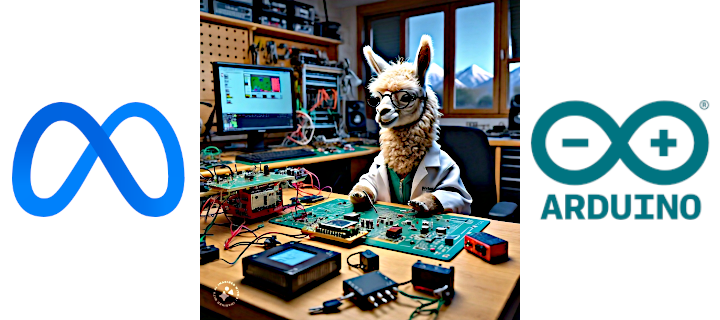

# [Meta AI](https://en.wikipedia.org/wiki/Meta_AI) Llama

Coding [Arduino](https://en.wikipedia.org/wiki/Arduino) sketches with [Meta](https://ai.meta.com/) [Llama](https://en.wikipedia.org/wiki/LLaMA) 3.
+ Meta Llama 3 web interface is free at [meta.ai](https://www.meta.ai/)
+ Use your [Facebook](https://www.facebook.com/) account to save your conversations history.
  + [Meta AI at Facebook](https://www.facebook.com/AIatMeta/)
+ The above center image was created by Llama 3.
+ Below is an example conversation with Llama 3.
+ Llama 3 code is in the [Sketches directory](https://github.com/WA9ONY/Arduino-Homework/tree/main/Llama/Sketches).
+ YouTube
  + [Metas LLAMA 3 Just STUNNED Everyone! (Open Source GPT-4)](https://youtu.be/cEHFzvU-pzk?si=Ah1YHwqmk6W77THK)
  + [LLaMA 3 Tested!! Yes, It’s REALLY That GREAT](https://youtu.be/0AaNT7XO41I?si=hwHiT2pSaT9tfC-g)

---

# Conversations with Llama 3 on April 20, 2024.
## What is Meta Llama 3?

Meta Llama 3 is an open-source large language model developed by [Meta](https://ai.meta.com/blog/meta-llama-3/). It is available on Cloudflare Workers AI and offers leading performance on a wide range of industry benchmarks, with a context window of 8k and a vocabulary of 128k tokens. Llama 3 has been fine-tuned with over 10 million human-annotated examples and is trained on a dataset of over 15 trillion tokens.

## Can Meta Llama 3 create Arduino sketches?

Yes, Meta Llama 3 can generate Arduino sketches. As a large language model, it can produce code in various programming languages, including C++ and Arduino sketches. You can provide a prompt or task description, and Llama 3 can generate a sketch to accomplish the task.
Here's an example prompt: "Generate an Arduino sketch to blink an LED connected to pin 13."
Keep in mind that the generated code may require adjustments and verification to work correctly, as the model is not perfect and may not always understand the specific requirements or constraints of a project.
If you have a specific project in mind, feel free to provide more details, and I can help you craft a prompt for Llama 3 to generate an Arduino sketch!

## What do you know about Arduino UNO R4 micro controller?

The Arduino UNO R4 is a 32-bit microprocessor that offers more speed, memory, connectors and connectivity options than any previous version of the board ¹. The UNO R4 microcontroller is based on the Renesas RA4M1 (Arm Cortex-M4) and has a 48 MHz clock speed, 32 KB of SRAM, 256 KB of flash memory and 8 KB of EEPROM ² ³. The UNO R4 also features a USB-C connector, a 12-bit DAC, CAN BUS, OP AMP, SWD port and support for battery-powered RTC ¹. Additionally, the UNO R4 has a built-in mechanism to detect operations that might cause the board to crash, such as division by zero, before they cause any trouble ¹.

## What is last date for Llama 3 training?

The Llama 3 model was released on April 18, 2024, and is available for use in English for commercial and research purposes. It was trained on a dataset of over 15 trillion tokens from public sources, and fine-tuned with over 10 million human-annotated examples. The model is intended for use in assistant-like chat and other natural language generation tasks.

## In a table layout compare the Arduino UNO R4 with the Arduino UNO R3.

Here's a table comparing the Arduino UNO R4 with the Arduino UNO R3 ¹:

## Arduino UNO R4 vs R3 Comparison

| **Feature** | **Arduino UNO R4** | **Arduino UNO R3** |
| --- | --- | --- |
| **Microcontroller** | Renesas RA4M1 48MHz Arm Cortex M4 | ATmega328P (16 MHz AVR) |
| **SRAM** | 32K | 2K |
| **Flash Memory** | 256K | 32K |
| **USB Connector** | USB-C | USB-B |
| **Max Voltage** | 24V | 20V |
| **Communication Interfaces** | I2C, SPI, UART, CAN | I2C, SPI, UART |

Summary

This table compares the key features of the Arduino UNO R4 and R3 boards. The UNO R4 offers significant upgrades, including a faster microcontroller, more memory, and additional communication interfaces.

## Please create an Arduino sketch to blink the built in LED at different frequencies to determine when the blinking LED looks allways on.

Here is an Arduino sketch to blink the built-in LED at different frequencies:
Arduino

### Arduino Sketch by Llama 3

```cpp

const int ledPin = LED_BUILTIN;  // the number of the LED pin

void setup() {
  pinMode(ledPin, OUTPUT);  // initialize the LED pin as an output
}

void loop() {
  // Blink at 1 Hz (1 second on, 1 second off)
  blink(ledPin, 1000, 1000);

  // Blink at 5 Hz (200ms on, 200ms off)
  blink(ledPin, 200, 200);

  // Blink at 10 Hz (100ms on, 100ms off)
  blink(ledPin, 100, 100);

  // Blink at 20 Hz (50ms on, 50ms off)
  blink(ledPin, 50, 50);

  // Blink at 50 Hz (20ms on, 20ms off)
  blink(ledPin, 20, 20);

  // Blink at 100 Hz (10ms on, 10ms off)
  blink(ledPin, 10, 10);
}

void blink(int pin, int onTime, int offTime) {
  digitalWrite(pin, HIGH);  // turn the LED on
  delay(onTime);           // wait for the specified time
  digitalWrite(pin, LOW);   // turn the LED off
  delay(offTime);           // wait for the specified time
}

```

This sketch uses the blink() function to blink the LED at different frequencies. The frequency is determined by the onTime and offTime parameters, which specify the duration of the on and off periods in milliseconds.
To determine when the blinking LED looks always on, you can adjust the frequency by changing the values of onTime and offTime in the blink() function calls. The LED will appear to be always on when the frequency is high enough that the human eye can't perceive the blinking.
Note that the maximum frequency is limited by the Arduino's clock speed and the duration of the delay() function. At very high frequencies, the LED may not be able to turn on and off quickly enough to produce a visible blinking effect.
Also, keep in mind that the built-in LED is usually connected to a digital pin, which can only provide a limited amount of current. If you're using an external LED, make sure to use a suitable resistor to limit the current and avoid damaging the LED or the Arduino board.

## Please update the Arduino sketch to print the frequency to the serial monitor and vary the delay by one from 10 to 30.

Here is the updated Arduino sketch:
Arduino

```cpp

const int ledPin = LED_BUILTIN;  // the number of the LED pin

void setup() {
  pinMode(ledPin, OUTPUT);  // initialize the LED pin as an output
  Serial.begin(9600);  // initialize serial communication at 9600 bps
}

void loop() {
  for (int delayTime = 10; delayTime <= 30; delayTime++) {
    // Blink at varying frequencies
    blink(ledPin, delayTime, delayTime);

    // Print the frequency to the serial monitor
    Serial.print("Frequency: ");
    Serial.print(1000.0 / (2 * delayTime));  // calculate and print the frequency
    Serial.println(" Hz");
  }
}

void blink(int pin, int onTime, int offTime) {
  digitalWrite(pin, HIGH);  // turn the LED on
  delay(onTime);           // wait for the specified time
  digitalWrite(pin, LOW);   // turn the LED off
  delay(offTime);           // wait for the specified time
}

```

This sketch will:
+ Blink the LED at varying frequencies by changing the delay time from 10 to 30 milliseconds.
+ Print the frequency (in Hz) to the serial monitor for each delay time.

Note that the frequency is calculated using the formula: 1000.0 / (2 * delayTime), where delayTime is the total time (in milliseconds) for one on-off cycle. The 2 * delayTime accounts for both the on and off periods.

Make sure to open the serial monitor (at 9600 bps) to see the frequency output.

## Please list the programming languages you can create code for.

I can generate code in a wide range of programming languages, including but not limited to:
+ Python
+ Java
+ JavaScript
+ C++
+ C#
+ PHP
+ Ruby
+ Swift
+ Go
+ Rust
+ TypeScript
+ Scala
+ Kotlin
+ Visual Basic (VB)
+ Perl
+ MATLAB
+ Arduino
+ SQL
+ HTML/CSS
+ Bash/Shell Script

Keep in mind that this list is not exhaustive, and I can likely generate code in other languages as well. If you have a specific language in mind, feel free to ask, and I'll do my best to assist you!

Also, note that my ability to generate code is focused on helping with small to medium-sized tasks, and I may not be able to create complex programs or entire applications from scratch. However, I can certainly help with snippets, examples, and guidance to get you started or assist with specific coding tasks.

## What micro controllers can you create code for?

I can generate code for a variety of microcontrollers, including but not limited to:
+ Arduino (Uno, Nano, Mega, ESP32, ESP8266, etc.)
+ Raspberry Pi (RPi)
+ STM32 (STM32F4, STM32F7, etc.)
+ ESP32 and ESP8266 (Espressif Systems)
+ AVR (ATmega328P, ATmega2560, etc.)
+ PIC (PIC16F877A, PIC18F4550, etc.)
+ ARM Cortex-M (M0, M3, M4, etc.)
+ TI MSP430 (MSP430G2553, MSP430FR5739, etc.)
+ Microchip PIC32 (PIC32MX795F512L, etc.)
+ Zilog Z80 (Z80A, Z80B, etc.)

Keep in mind that this list is not exhaustive, and I can likely generate code for other microcontrollers as well. If you have a specific microcontroller in mind, feel free to ask, and I'll do my best to assist you!

Also, note that my ability to generate code is focused on helping with small to medium-sized tasks, and I may not be able to create complex programs or entire applications from scratch. However, I can certainly help with snippets, examples, and guidance to get you started or assist with specific coding tasks.

## Please list the different RP2040 boards that you can create code for.

Here are some of the RP2040 boards you can create code for ¹ ² ³:
+ Raspberry Pi Pico: a low-cost, high-performance microcontroller board with flexible digital interfaces.
+ Thing Plus: a board that includes an SD card slot, 16 MB (128 Mbit) flash memory, a JST single cell battery connector, an addressable RGB LED, JTAG PTH pins, four (4-40 screw) mounting holes and a Qwiic connector.
+ Pro Micro RP2040: a board that utilizes the Pro Micro footprint and includes a WS2812B addressable LED, boot button, reset button, Qwiic connector, USB-C and castellated pads.
+ Feather RP2040: a board with a curated selection of pins that can take advantage of an expansive range of add-ons called “FeatherWings.”
+ QT Py RP2040: a board that includes a curated selection of GPIO pins for projects and a Stemma QT / Qwiic connector which breaks out an additional I2C connection for use with Stemma QT / Qwiic compatible components.
+ RP2040 Stamp: a small board designed for use in your own PCBs with 8MB of flash storage and a full complement of GPIO pins forming a perimeter of castellations around the board.
+ Pico LiPo: a drop-in replacement for the Raspberry Pi Pico that provides all of the GPIO pins found on a Pico, with added bonus of onboard LiPo / Li-Ion charging and a Stemma QT / Qwiic connector.
